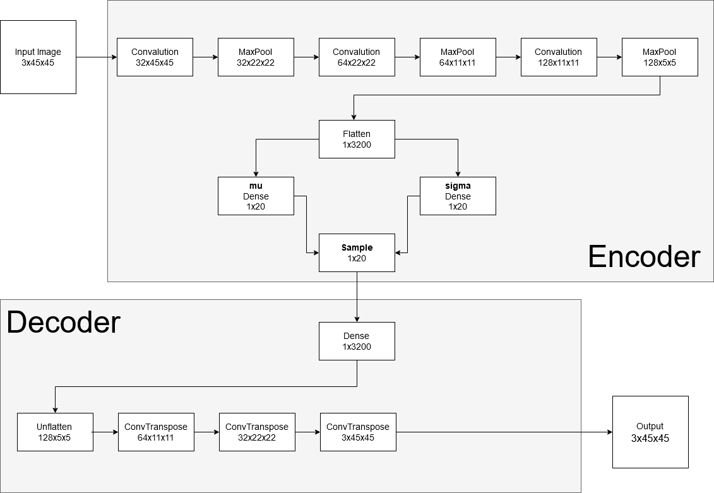

# searchFacebot
A telegram bot that searches for a similar face image using a variational autoencoder.

## About bot
**SearchFacebot** was created as part of the final project of the Deep Learning School.
It was trained on the [open dataset "Marked faces in the wild"](http://vis-www.cs.umass.edu/lfw/).

A database of face photographs designed for studying the problem of unconstrained face recognition.
The data set contains more than 13,000 images of faces collected from the web.
Each face has been labeled with the name of the person pictured.

## About model
Bot based on the variational autoencoder model with the dimension latent space of 20. Convolutional neural network model is used for feature extraction.

Model scheme:

